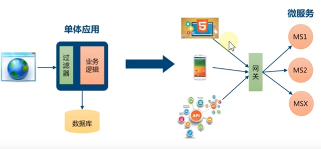
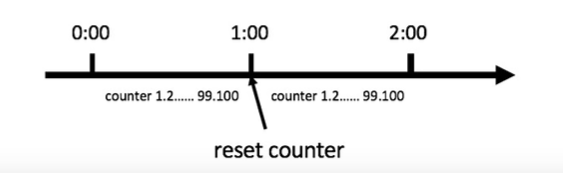
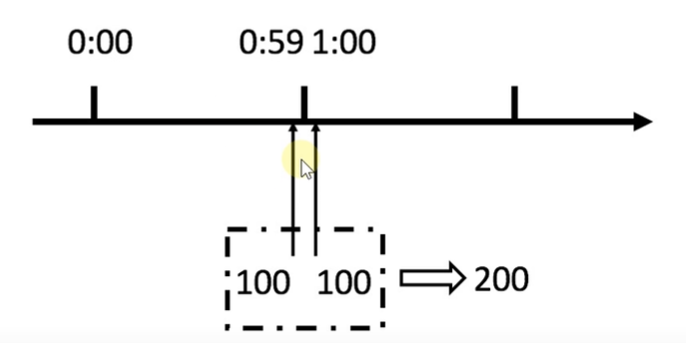

# gateway网关

## 1.学习目标、

​	

## 2.什么是 Spring Cloud Gateway

​	Spring Cloud Gateway作为 Spring Cloud生态系统中的网关，目标是代 Netflix Zur，其不仅提供统一的路由方式，并且还基于 Filter链的方式提供了网关基本的功能，目前最新版 Spring Cloud中引用的还是Zull 1.3x版本，而这个版本是基于过滤器的，是阻塞IO，不支持长连接

​	Zull 2.x版本一直跳票，2019年5月， Netflix终于开源了支持异步用模式的Zull 2.0版本，真可谓千呼万唤始出来，但是Spring Cloud已经不再集成Zull 2.x了，那么是时候了解一下 Spring Cloud Gateway了，Spring Cloud Gateway是基于 Spring生态系统之上构建的AP网关，包括：Spring5， Spring Boot2和 Project Reactor, Spring Cloud Gateway旨在提供一种简单而有效的方法来路由到API，并为它们提供持领域的关注点，例：安全性，监视/指标，限流等，由于 Spring5.0支持Netty,Http2，而 Spring Boot2.0支持 Spring5.0，因此 Spring Cloud Gateway支持 Netty和Http2顺理成章。

## 3.什么是服务网关

​	API Gateway（APw/AP网关），顾名思义，是出现在系统边界上的一个面向API的、串行集中式的强管控服务界是企业系统的边界，可以理解**为企业级应用防火墙**，主要**起到隔离外部访问与内部系统的作用**，在微服务概念流行之前，AP网关就已经诞生了，例如银行、证券等领域常见的前置机系统，它也是解决访问认证、报文转换、访问统计等问题的。

​	API网关的流行，源于近几年来移动应用与企业间互联需求的兴起，移动应用、企业互联，使得后台服务支持的对象，从以前单一的Web应用，扩展到多种使用场景，且每种使用场景对后台服务的要求都不尽相同，这不仅增加了后台服务的响应量，还增加了后台服务的复杂性，**随着微服务架构概念的提出，API网关成为了微服务架构的一个标配组件**

​	API网关是一个服务器，是系统对外的准一入口，API网关封装了系统内部架构，为每个客户端提供定制的API，所有的客户端和消都通过统一的网关接入微服务，在网关层处理所有非业务功能，API网关并不是微服务场最中必须的组件，如下图，不管有没有API网关，后微服务都可以通过API很好地支持户端的访间问

但对于服务数量众多、复杂度比较高、规模比较大的业务来说，引入AP网关也有一系列的好处：

- 聚合接口使得服务对用者透明，喜户璃与后的耦台度降低
- 聚合后台服务，节背流量，提高性能，提升用户体验
- 提供安全、流控、过滤、缓存，计费、监控等AP管理功能

## 4.为什么要使用网关

- 单体应用：浏览器发起请求到单体应用所在的机器，应用从数据库查询数据原路返回给浏览器，对于单体应用来说是不需要网
- 微服务：做服务的应用可能部器在不同机房，不同地区，不同域名下，此时户姨（浏览器/手机件工具）想要请求对应的服务，都需要知道机器的具体IP或者域名URL，当微服务实例众多时，这是非常难以记忆的，对于客户端来说也太复杂难以维护。此时就有了网关，高户端相关的清求直接发送到网关，由网关根据请求标识解析判断出具体的微服务地址，再把请求转到微服务实例，这其中的记忆功能就全部交由网关来操作了

总结：

如果让客户直接与各个微服务交互：

- 客户端会多次请求不同的微服务，增加了客户的复杂性
- 存在跨域请求，在一定场景下处理相对复杂
- 身份认证问题，每个微服务需要独立身份认证
- 难以重构，随着项目的选代，可能需要重新划分微服务
- 某些微服务可能使用了防火墙/浏览器不友好的协议，直接访问会有一定的因难

因此，我们需要网关介于客户浏与服务器之间的中间层，所有外部请求率先经过微服务网关，客户端只需要与网关交互，只需要知道网关地址即可，这样便简化了开发且有以下优点

- 易于监控，可在微服务网关收集监控数据并将其推送到外部系统进行分析
- 易于认证，可在微服务网关上进行认证，然后再将请求转发到后菌的微服务，从而无需在每个微服务中进行认证
- 减少了客户端与各个微服务之间的交互次数

## 5.网关解决了什么问题

网关具有身份认证与安全、审查与监控、动态路由、负载均衡、缓存、请求分片与管理、静态响应处理等功能，当然最主要的职能还是与“外界联系”

总结一下，网关应当具备以下功能

- 性能：API高可用，负载均衡，容错机制
- 安全：权限身份认证、脱敏，流量清洗，后钠签名（保证全链路可信词用），黑名单（非法调用的限制）
- 日志：日志记录，一且涉及分布式，全链路跟必不可少
- 缓存：数据缓存
- 监控：记录请求响应数据，API耗时分析，性能监控
- 限流：流量控制，辑峰流控，可以定义多种限流规则
- 灰度：线上灰度部器，可以减小风险
- 路由：动态路由规则

## 6.常用网关解决方离

### 6.1 Nginx + Lua

Nginx是由 igorsysoev为俄罗斯访问量第二的 Rambler站点开发的，一个高性能的HTP和反向代理服务器.Ngn一方面可以做反向代理，另外一方面做可以做静态资源服务器

> - Nginx适台做门户网关，是作为整个全局的网关，对外的处于最外层的部种；而 Gateway属于业务网关，主要用来对应不同的客户提供服务，用于聚合业务，各个微服务独立部器，职责单一，对外提供服务的时候需要有一个东西把业努聚合起来
> - Gateway可以实现熔断、重试等功舰，这是Ngnx不具备的

### 6.2 Kong

​	Kng是 Mashape提供的一款AP管理软件，它本身是基于Ngnx+Lua的，但比 Nginx提供了更简单的配置方式，数据采用了ApacheCassandra/PostgreSQL存储，并且提供了一些优秀的播件，比如验证，日志，调用须次限制等，Kong非常诱人的地方就是提供了大量的插件来扩展应用，通过设置不同的播件可以为服务提供各种增强的功能

> - 优点：基于Nginx所以在性能和稳定性上都没有问题，Kong作为一款商业软件，在Nginx上做了很扩展工作，而目还有很多付要的业播件，Kong本身也有付熟的企业版，其中包括技木支持、使用培训服务以及AP分析插件
> - 缺点：如果你使用 Spring cloud,Kong如何结合目前已有的服治理体系?

### 6.3. Trafik 

​	Trafik是一个开源的G0语言开发的为了让部署微服务更加便捷而诞生的现代HTTP反向代理、负载均衡工具，它支持多种后台（ Docker, swarn, Kubernetes, Marathon, Mesos, Consul,Etcd, Zookeeper, BoltDB, Rest APl. file，来目动化、动态的应用它的配置文件设置， Trafik拥有一个基于 AngularIS编写的简单网站界面，支持 Rest API，配置文件热更新，无需重启进程，高可用集群模式等

> 相对 Spring Cloud和 Kubernetes而言，目前比较适 Kubernetes

### 6.4. Spring Cloud Netflix Zuul 

​	Zull是Netflix公司开源的一个API网关组件， Spring Cloud对其进行二次基于 Spring Boot的注解式封装做到开箱即用，目前来说，结台 Sring Cloud提供的服务治理体系，可以做到请求转发，根据配置或者默认的路由规则进行路由和 Load Balance，无缝集成 Hystrix

> 虽然可以通过自定义Fte实现我们想要的功能，但是由于Zu本身的设计是基于**单线程的接收请求和转发处理，**是阻塞o，不支持长连接，目前来看Zull就显得很鸡助，随着Zull 2.x一直跳票（2019年5月发布了Zu2.0版本）， Spring Cloud推出自己的 Spring Cloud Gateway
>
> 大意就是：Zull已死， Spring Cloud Gateway永生（手动狗头）

Zull 1.0

Zull 2.0

## 7.环境准备

- eureka- server：注册中心
- eureka- server2：注分中心
- product-service：商品服务，提供了根据主键查询商品接口http://localhost:7070/product/{id} 
- order-servace订单服务，提供了根据主键查询订单接囗http://localhost:9090/order/{id}且订单服务调用商品服务

## 8. Nginx实现AP网关

​	之前的课程中我们已经详细的讲解过Ngnx关于反向代理、负载均衡等功能的使用，这里不再述，这里主要通过Ngnx来实现AP网关方便大家更好的字习和理解 Spring Cloud Gateway的使用，。

### 81.下载

官网：http://nginx.org/en/download.html下载稳定版，为了方便字习，请下载 Windows版本

### 8.2 安装

### 8.3 配置路由规则

​	进入Nginx的conf目录，打开 nginx.conf文件，配置路由规则：

### 8.4 访问

​	之前我们如果要访问服务，必须由客户端指定具体服务地址访问，现在统一访问Nginx，由Ngnx实现网关功能将请求路由至具体的服务。

访问：http://localhost/api/product

## 9.Gateway实现AP网关

​	官网文档：https://docs.spring.io/spring-cloud-gateway/docs/current/reference/html/

### 9.1.核心概念

​	路由（ Route）：路由是网关最基础的部分，路由信息由ID,目标URI、一组断言和一组过滤器组成，如果断言路由为真，则说明请求的UR和配置匹配

​	断言（ Predicate）：JAVA8中的断言函数， Spring Cloud Gateway中的断言函数输入类型是 Spring5.0框架中的ServerWebExchange. Spring cloud Gateway中的断言函数允许开发者去定义匹配来自于 Http Request中的任何信息，比如请求头和梦数等。

​	过滤器（ Filter）：一个标准的 Spring web Filter, Spring Cloud Gateway中的Fter分为两种类型，分别是 Gateway Filter和obal Filter，过滤器将会对请求和响应进行处理。

### 9.2 工作原理

​	如上图所示，客户端向 **Spring Cloud Gateway**发出清求，再由网关处理程序 **Gateway Handler Mapping**映射确定与请求相匹配的路由，将其发送到**网关Web处理程序** **Gateway web Handler**，该处理程序通过指定的过滤器链将请求发送到我们实际的服务执行业努逻，然后返回，过滤器由虚线分隔的原因是，过滤器可以在发送代理请求之前和之后运行逻辑，所有**pre**过滤器逻辑均被执行，然后发出代理请求，发出代理请求后，将运行**post**过滤器逻辑

### 9.3 搭建网关服务

#### 9.3.1 创建项目

## 10.路由规则

​	Spring Cloud Gateway创違 Route对象时，使用 Route Predicate Factory创建 Predicate对象， Predicate对象可以赋值给

- Spring Cloud Gateway包含许多内置的 Route Predicate Factories
- 所有这些断言都匹配HTTP请求的不同属性
- 多个 Route predicate factories可以通过逻辐与（and）结台起来一起使用

​	路由断言工厂 RoutePredicateFactory包含的主要实现类如图所示，包括 Datetime、请求的远地址、路由权重、请求头Hos地址、请求方法，请求路径和清求参数等类型的路由断言。

## 11.动态路由（服务发现的路由规则）

​	动态路由其实就是面向服务的路由， Spring Cloud Gateway支持与 Eureka整台开发，根据 serviceid自动从注册中心获取服务地址并转发清求，这样做的好处不仅可以通过单个点来访问应用的所有服务，而且在添加或移除服务实例时不用修改 Gateway的路由配置.

### 11.1添加依赖

### 11.2 动态获取URI

#### 11.2.1 配置文件

### 11.3 服务名称转发

## 12. 过滤器

​	Spring Cloud Gateway根据作用范围划分为 GatewayFilter和Globa1Filter，二者区别如下:

- **GatewayFllter**：网关过速器，需要通i过 **spring.cloud.routes.filters**配置在具体路由下，只作用在当前路由上或通过 **spring.cloud.default-filters**配置在全局，作用在所有路由上
- **GlobalFllter**：全局过滤器，不需要在配置文件中配置，作用在所有的路由上，最终通过 **GatewayFilterAdopter**包装成 **GatewayFilterChain**可识别的过滤器，它为请求业务以及路由的URI转换为真实业务服劳请求地址的核心过滤器，不需要配置系统初始化时加载，并作用在每个路由上.

### 12.1.网关过滤器 GatewayFilter

​	网关过滤器用于拦截并链式处理Web请求，可以实现横切与应用无关的需求，比如：安全、访问超时的设置等。修改传入的HTTP请求或传出HTTP响应，SpringCloudGateway包含许多内置的网关过滤器工厂一共有22个，包括头部过滤器、路径类过滤器、 Hystrix过滤器和重写请求URL的过滤器，还有参数和状态码等其他类型的过滤器，根据过滤器工厂的用途来划分，可以分为以下几种：Header, Parameter、Path、Body、 Status、 Session、 Redirect，Rety、 RateLimiter和Hystrix，

下来我们举例说明其中一部分如何使用，其余等大家工作中需要应用时再查询资料字习或者咨询我也可以

#### 1211 Path路径过滤器

​	Path路径过滤器可以实现URL重写，通过重写URL可以实现隐藏实际路径提高安全性，易于用户记忆和键入，易于被搜索引零收录等优点。实现方式如下：

##### 12.1.1.1. Rewrite Path Gateway FilterFactory

​	Rewnte Path网关过滤器工厂采用路径正则表达式参数和替换参数，使用Java正则表达式来灵活地重写请求路径，

### 12.2 全局过滤器GlobalFilter

​	全局过滤器不需要在配置支件中配置，作用在所有的路由上，最终通过 Gateway FilterAdapter包液成 Gateway FilterChain可识别的过滤器，它是请求业务以及路由的U刚转换为真实业务服务请求地址的核心过器，不需要配置系统初始化时加载，并作用在每个路由上

## 13.网关限流

​	顾名思义，限流就是限制流量，就像你宽带包有1个G的流量，用完了就没了，通过限流，我们可以很好地控制系统的QPs从而达到保护系统的目的

### 13.1为什么需要限流

比如web服务、，对外AP，这种类型的服劳有以下几种可能导致机器被拖垮

- 用户增长过快（好事
- 因为某个热点事件（做薄然搜）
- 竞争对象爬虫
- 恶意的请求

​	这些情况都是无法预知的，不知道什么时候会有10倍甚至20倍的流量打进来，如果真碰上这种情况，扩容是根本来不及的

### 13.2.限流算法

常见的限流算法有：

- 计数器算法
- 漏桶（ Leaky Bucket）算法
- 令牌桶（ Token Bucket）算法

#### 13.2.1.计数器算法

​	计数器算法是限流算法里最简单也是最容易实现的一种算法，比如我们规定，对于A接口来说，我们1分钟的访间次数不能超过100个，那么我们可以这么做：在一开始的时候，我们可以设置一个计数器 counter，每当一个请求过来的时候， counter就加1，如果 counter的值大于100并且该清求与第一个请求的可时间还不在1分钟之内，般发限流：如果该请求与第一个请求的间隔时间大于1分钟，重置 counter重新计数，具体算法的示意图如下：

​	这个算法里然简单，但是有一个十分致命的问题，那就是临界问，我们看下图

​	从上图中我们可以看到，假设有一个恶意用户，他在0:59时，瞬间发送了100个请求，并且1:00又瞬间发送了100个请求那么其实这个用户在1秒里面，瞬间发送了200个请求，我们刚才规定的是1分钟最多100个请求，也就是每秒钟最多17个请求，用户通过在时间窗口的重置节点处突发清求，可以间超过我们的速率限制，用户有可能通过算法的这个深洞，瞬间压垮我们的应用

​	还有资料浪费的问存在，我们的预明想法是希望100个请求可以均匀分散在这一分钟内，假设30s以内我们就请求上限了，那么剩余的半分钟服务器就会处于闲置状态，比如下图

#### 13.2.2 漏桶算法

​	漏桶算法其实也很简单，可以粗略的认为就是注水漏水的过程，往桶中以任息速率流入水，以一定速率流出水，当水超过桶流量则丢弃，因为桶容量是不变的，保证了整体的速率。

漏桶算法是使用队列机制实现的：

#### 13.2.3.令牌桶算法

​	令牌桶算法是对桶算法的一种改进，桶算法能够限制请求用的速率，而令牌桶算法够在限制调用的平均速率的同时还允许一定程度的央发调用，在桶算法中，存在一个桶，用来存放固定数量的令牌，算法中存在一种机制，以一定的速率往桶中放命牌，每次请求调用需要先获取令牌，只有到今牌，才有机会继续执行，否则选择选择等待可用的令牌、或者直接拒绝。放令牌这个动作是持续不断的进行，如果桶中令牌数达到上限，就丢弃令牌

> 场景大概是这样的：桶中一直有大量的可用令牌，这时进来的请求可以直接拿到牌执行，比如设置QPs为100/s，那么限流器初始化完成一秒后，桶中就已经有100个令牌了，等服务启动完成对外提供服务时，该限流器可以抵挡瞬时的100个请求，当桶中没有命牌时，请求会进行等待，最后相当于以一定的速率执行

​	Spring Cloud Gateway内部使用的就是该算法，大描述如下：

- 所有的请求在处理之前都需要拿到一个可用的命牌才会被处理
- 根据限流大小，设置按照一定的速率往桶里添加令牌
- 桶设置最大的放置令牌限制，当桶时、新添加的令牌就被丢弃或者拒绝
- 清求到达后首先要获取令牌桶中的令牌，拿着合牌才可以进行其他的业务逻辑，处理完业务逻辑之后，将令牌直接删除
- 令牌桶有最低限额，当桶中的令牌达到最低限题的时候，请求处理完之后将不会删除令牌，以此保证足够的限流

## 14.高可用网关

​	业内通常用多少9来衡量网站的可用性，例如QQ的可用性是4个9，就是说QQ能够保证在一年里，服务在99.99%的时间是可用的，只有0.01%的时不可用，大约最多53分钟

​	对于大多数网站，2个9是基本可用；3个9是叫高可用；4个9是拥有自动恢复能力的高可用

​	实现高可用的主要手段是**数据的冗余备份**和**服务的失效转移**，这两种手段具体可以怎么做呢，在网关里如何体现？主要有以下几个方向:

- 集群部署
- 负载均衡
- 健康检查
- 节点自动重启
- 熔断
- 服务降级
- 接口重试

## 14.1. Nginx+网关集群实现高可用网关

