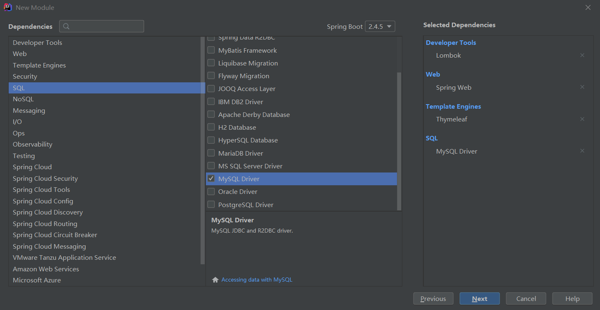

# Mybatis Plus

```txt
B站视频学习笔记记录
MP官网：
https://baomidou.com/guide/annotation.html#sqlparser
```

国产的开源框架，基于MyBatis

核心功能就是简化MyBatis的开发，提高效率

## MyBatis Plus快速上手

SpringBoot (2.4.5)+ MyBatis Plus(国产的开源框架，并没有接入到Spring官方孵化器中)

### 创建Maven工程



### 接下来需要pom.xml中手动添加mybatis-plus的依赖

```xml
<dependency>
    <groupId>com.baomidou</groupId>
    <artifactId>mybatis-plus-boot-starter</artifactId>
    <version>3.4.2</version>
</dependency>
```

注意：不能直接添加mybatis-plus，而是添加mybatis-plus-boot-starter，添加进去spring boot的依赖当中去

### 创建实体类

```java
@Data
public class Users {
    private Integer id;
    @TableField("userid")
    private String userId;
    @TableField("department_id")
    private Integer departmentId;

}
```

### application.yml配置文件

```yaml
spring:
  datasource:
    driver-class-name: com.mysql.cj.jdbc.Driver
    url: jdbc:mysql://localhost:3306/myemployees?useUnicode=true&characterEncoding=UTF-8
    username: root
    password: 1230
mybatis-plus:
  configuration:
    log-impl: org.apache.ibatis.logging.stdout.StdOutImpl
```

### 如果需要打印详细的log日志，以及详细sql情况，需要在配置文件 中添加

```yml
mybatis-plus:
  configuration:
    log-impl: org.apache.ibatis.logging.stdout.StdOutImpl
```


### 创建Mapper接口

```java
public interface UsersMapper extends BaseMapper<Users> {
}
```

### 启动类需要添加@MapperScan("mapper所在的包")，否则无法加载Mapper bean

```java
@SpringBootApplication
@MapperScan("com.hfwas.mybatisplus.mapper")
public class Application {
    public static void main(String[] args) {
        SpringApplication.run(Application.class, args);
    }
}
```

### 测试

```
package com.hfwas.mybatisplus.mapper;

import org.junit.jupiter.api.Test;
import org.springframework.beans.factory.annotation.Autowired;
import org.springframework.boot.test.context.SpringBootTest;
/**
 * @Author: HFwas
 * @Date: 2021/5/3
 * @Description: com.hfwas.mybatisplus.mapper
 * @version: 1.0
 */
@SpringBootTest
class UsersMapperTest {

    @Autowired
    private UsersMapper usersMapper;

    @Test
    void userMappersTest(){
        usersMapper.selectList(null).forEach(System.out::println);
    }

}
```

