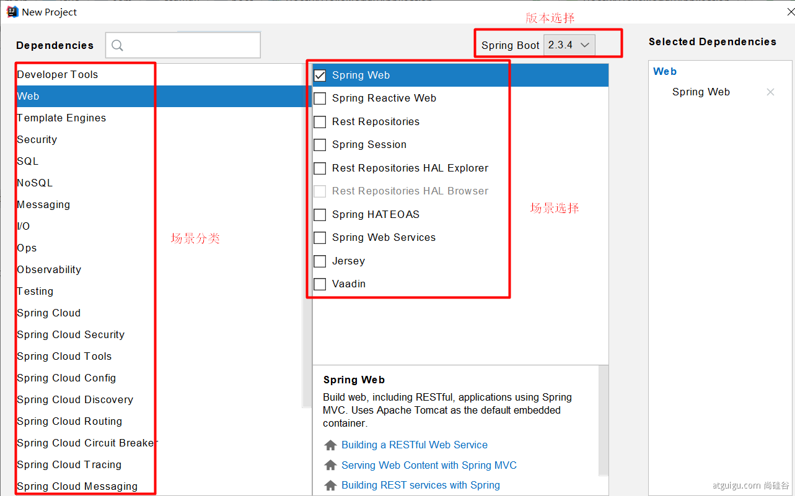
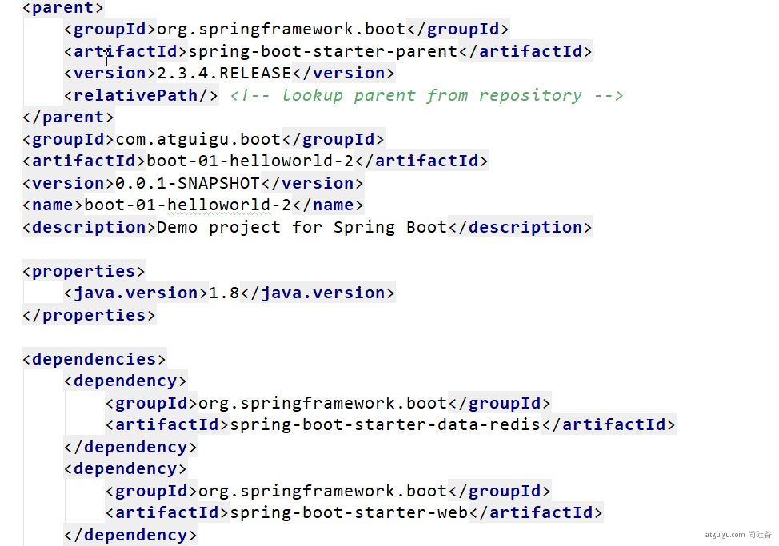
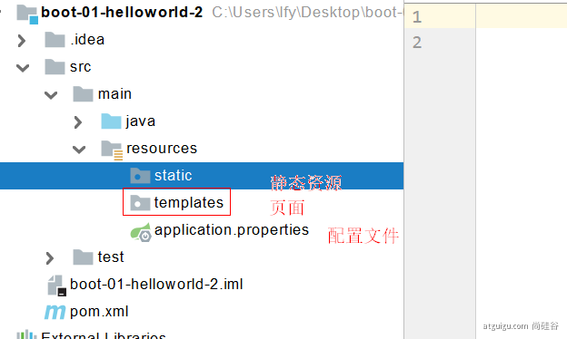
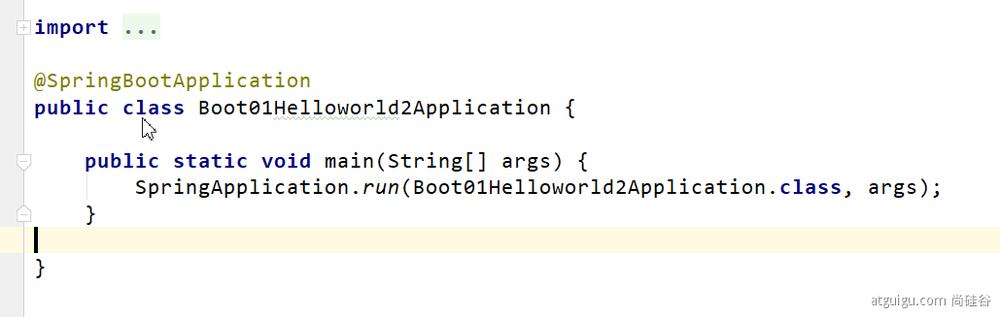

# spring boot实践知识

## 最佳实践

- 引入场景依赖

- - https://docs.spring.io/spring-boot/docs/current/reference/html/using-spring-boot.html#using-boot-starter

- 查看自动配置了哪些（选做）

- - 自己分析，引入场景对应的自动配置一般都生效了
  - 配置文件中**debug=true**开启自动配置报告。Negative（不生效）\Positive（生效）

- 是否需要修改

- - 参照文档修改配置项

- - - https://docs.spring.io/spring-boot/docs/current/reference/html/appendix-application-properties.html#common-application-properties
    - 自己分析。xxxxProperties绑定了配置文件的哪些。

- - 自定义加入或者替换组件

- - - @Bean、@Component。。。

- - 自定义器  **XXXXXCustomizer**；
  - ......

# 开发小技巧

## Lombok

简化JavaBean开发

```java
        <dependency>
            <groupId>org.projectlombok</groupId>
            <artifactId>lombok</artifactId>
        </dependency>


idea中搜索安装lombok插件
===============================简化JavaBean开发===================================
@NoArgsConstructor
//@AllArgsConstructor
@Data
@ToString
@EqualsAndHashCode
public class User {

    private String name;
    private Integer age;
    private Pet pet;
    public User(String name,Integer age){
        this.name = name;
        this.age = age;
    }
}

================================简化日志开发===================================
@Slf4j
@RestController
public class HelloController {
    @RequestMapping("/hello")
    public String handle01(@RequestParam("name") String name){   
        log.info("请求进来了...."); 
        return "Hello, Spring Boot 2!"+"你好："+name;
    }
}
```

## dev-tools

```java
        <dependency>
            <groupId>org.springframework.boot</groupId>
            <artifactId>spring-boot-devtools</artifactId>
            <optional>true</optional>
        </dependency>
```

项目或者页面修改以后：Ctrl+F9；


## Spring Initailizr（项目初始化向导）

### 选择我们需要的开发场景



### 自动依赖引入




### 自动创建项目结构



### 自动编写好主配置类



###### 